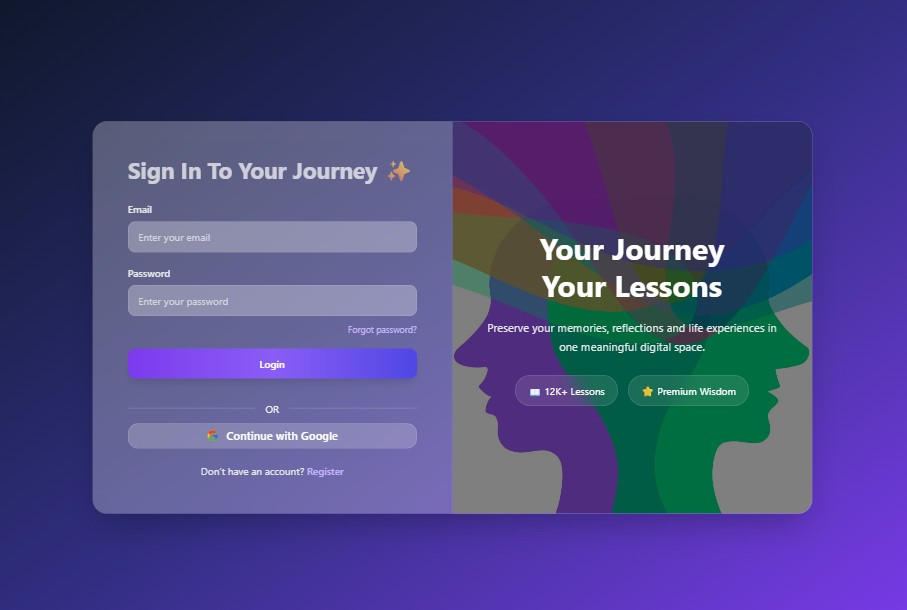
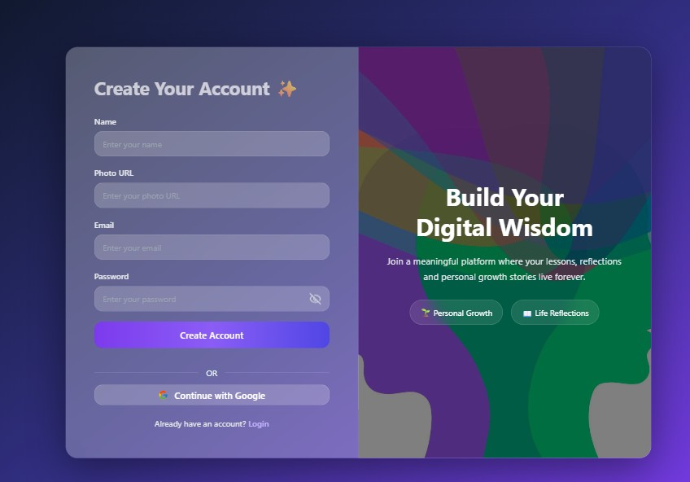

# LifeSpark

LifeSpark is a modern learning platform built with React, Vite, Firebase, and Tailwind CSS. It provides a polished public experience for browsing lessons, a protected user dashboard for managing content and favorites, and an admin area for moderation and oversight.

# Overview

The application is designed as a full-featured educational marketplace where learners can discover lessons, view detailed lesson pages, interact through comments, and access premium pricing flows. Authenticated users get access to their personal dashboard, while admins can manage users, lessons, and reports from a dedicated control panel.

## 🌐 Live Website

[Client Demo](https://life-spark-1b54e.web.app)
[Server Demo](https://life-spark-server.vercel.app/)

---

## 📸 Screenshot

### 🔐 Login Page
Users can securely log into their accounts using email and password authentication.
### 📝 Registration Page
New users can create an account by providing their basic information and credentials.

```md



<p align="center">
  
  
</p>

```

---

## ✨ Main Features

* 🔐 Firebase Authentication
* 👑 Admin Dashboard
* 📚 Create & Manage Lessons
* ❤️ Favorite Lessons System
* 🚫 Ban / Unban Users
* 🗑️ Delete Users & Lessons
* 💳 Stripe Payment Integration
* 📱 Fully Responsive Design
* ⚡ Modern Dashboard UI
* 🔎 Search & Filter Users
* 🛡️ JWT / Firebase Token Security

---

## 👑 Admin Features

* Manage all users
* Make admin
* Ban / Unban users
* Delete users
* Manage lessons
* View reports
* Track admin activities

---

## 👤 User Features

* Add lessons
* Update lessons
* Delete lessons
* Save favorite lessons
* View lesson details
* Comment on lessons

---

## 🛠️ Technologies Used

### Frontend

* React
* React Router
* Tailwind CSS
* DaisyUI
* React Query
* Axios
* Firebase
* SweetAlert2
* Lucide React

### Backend

* Node.js
* Express.js
* MongoDB
* Firebase Admin SDK
* JWT Authentication

---

## 📦 NPM Packages

### Client

```bash
npm install react-router @tanstack/react-query axios firebase sweetalert2 lucide-react react-icons
```

### Server

```bash
npm install express mongodb cors dotenv firebase-admin stripe
```

---

## ⚙️ Environment Variables

### Client

```env
VITE_apiKey=
VITE_authDomain=
VITE_projectId=
VITE_storageBucket=
VITE_messagingSenderId=
VITE_appId=
```

### Server

```env
DB_USER=
DB_PASSWORD=
STRIPE_SECRET_KEY=
FB_SERVICE_KEY=
SITE_DOMAIN=
```

---

## 💻 Run Locally

### Client

```bash
npm install
npm run dev
```

### Server

```bash
npm install
nodemon index.js
```

---

## 🔒 Authentication

* Firebase Authentication
* Firebase Admin Token Verification
* Protected Routes
* Admin Protected Routes

---


## 👨‍💻 Developer

Developed with ❤️ by Sohag Ali

