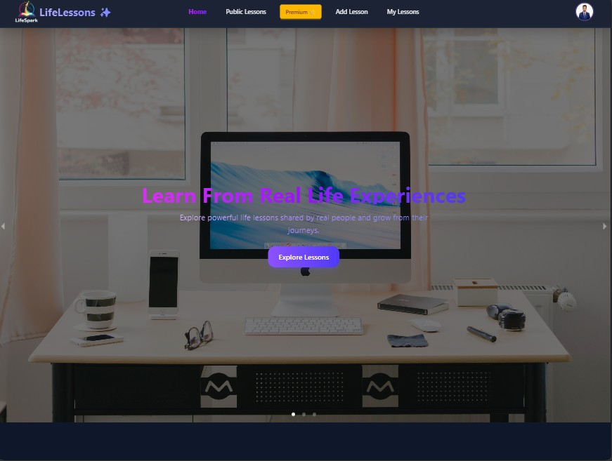
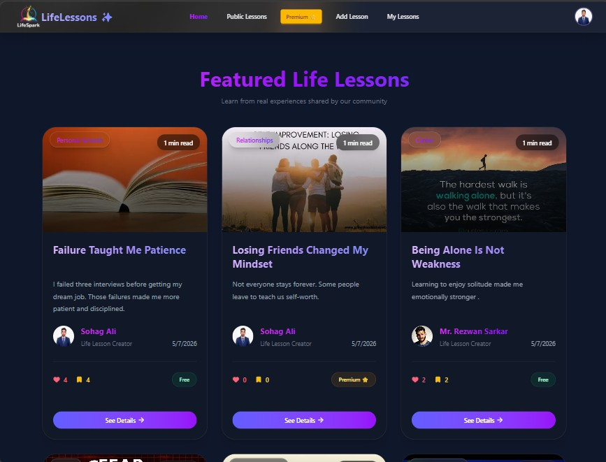
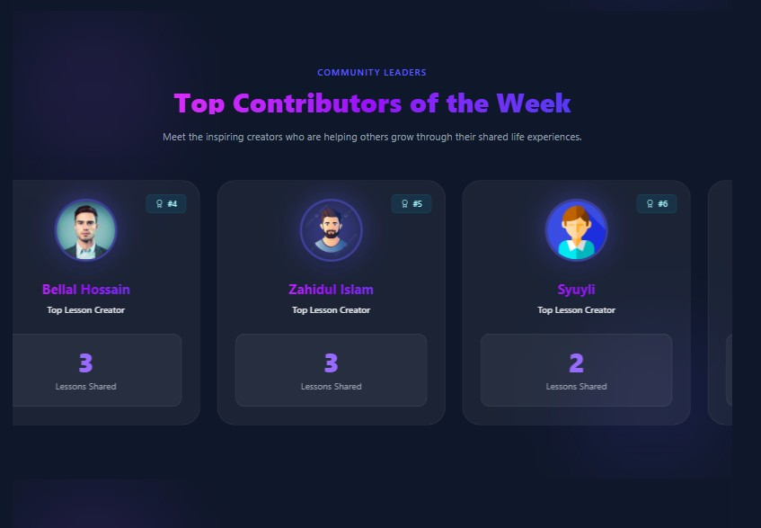
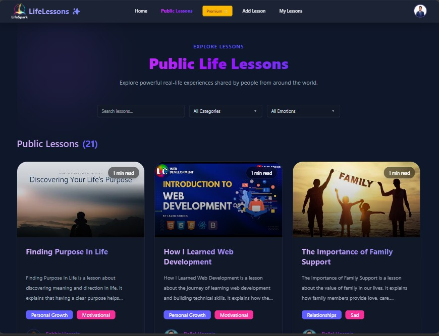

# LifeSpark

LifeSpark is a modern learning platform built with React, Vite, Firebase, and Tailwind CSS. It provides a polished public experience for browsing lessons, a protected user dashboard for managing content and favorites, and an admin area for moderation and oversight.

# Overview

The application is designed as a full-featured educational marketplace where learners can discover lessons, view detailed lesson pages, interact through comments, and access premium pricing flows. Authenticated users get access to their personal dashboard, while admins can manage users, lessons, and reports from a dedicated control panel.

## 🌐 Live Website

[Client Demo](https://life-spark-1b54e.web.app)
[Server Demo](https://life-spark-server.vercel.app/)


## 📸 Screenshot

### 🔐 Login Page
Users can securely log into their accounts using email and password authentication or Login instantly using their Google account.
### 📝 Registration Page
New users can create an account by providing their basic information and credentials or sign up instantly using their Google account.

<p align="center">
  
  
</p>

### Home Page
হোম পেজটি ব্যবহারকারীদের জন্য একটি আকর্ষণীয় ও ইন্টারঅ্যাকটিভ অভিজ্ঞতা প্রদান করে। শুরুতেই রয়েছে Cursor effect ব্যবহার করে তৈরি করা একটি আধুনিক ও animated banner section, যা ওয়েবসাইটটিকে আরও প্রাণবন্ত ও দৃষ্টিনন্দন করে তোলে।

এরপর রয়েছে **Featured Lessons** সেকশন, যেখানে অ্যাডমিন গুরুত্বপূর্ণ ও মানসম্মত লেসনগুলো নির্বাচন করে প্রদর্শন করতে পারেন। ব্যবহারকারীরা এখান থেকে সহজেই গুরুত্বপূর্ণ লেসনগুলো খুঁজে পেতে পারে।

হোম পেজে আরও রয়েছে **Top Contributors of the Week** সেকশন, যা swiper slider ব্যবহার করে তৈরি করা হয়েছে। এখানে সপ্তাহের সেরা ও সবচেয়ে সক্রিয় কন্ট্রিবিউটরদের প্রদর্শন করা হয়।

এছাড়াও ব্যবহারকারীরা **Most Saved Lessons** সেকশনের মাধ্যমে সবচেয়ে বেশি save করা জনপ্রিয় লেসনগুলো দেখতে পারে, যা নতুন ও গুরুত্বপূর্ণ কনটেন্ট খুঁজে পেতে সাহায্য করে।

সবশেষে রয়েছে একটি সুন্দর ও তথ্যবহুল footer section, যেখানে প্রয়োজনীয় লিংক, রিসোর্স এবং অতিরিক্ত তথ্য যুক্ত করা হয়েছে যাতে ব্যবহারকারীরা সহজে প্রয়োজনীয় তথ্য খুঁজে পেতে পারে।
<p align="center">
  
  
  
</p>

# public Lesson page
পাবলিক লেসন পেজটি এমনভাবে তৈরি করা হয়েছে যাতে লগইন ছাড়া যেকোনো ব্যবহারকারীও লেসনগুলো দেখতে পারে। ব্যবহারকারীরা সহজেই বিভিন্ন লেসন ব্রাউজ করতে এবং প্রয়োজন অনুযায়ী খুঁজে নিতে পারে।
এই পেজে রয়েছে powerful search functionality, যার মাধ্যমে ব্যবহারকারীরা lesson title, category এবং emotion অনুযায়ী লেসন সার্চ করতে পারে। ফলে নিজের আগ্রহ ও প্রয়োজন অনুযায়ী কনটেন্ট খুঁজে পাওয়া আরও সহজ হয়।
প্রতিটি lesson card এ lesson related গুরুত্বপূর্ণ তথ্য যেমন lesson creator এর নাম, publish date, likes এবং অন্যান্য তথ্য প্রদর্শন করা হয়, যাতে ব্যবহারকারীরা লেসন সম্পর্কে দ্রুত ধারণা নিতে পারে।
তবে শুধুমাত্র লগইন করা ব্যবহারকারীরাই lesson details page এ প্রবেশ করতে পারবে। যদি কোনো ব্যবহারকারী লগইন ছাড়া details page এ যেতে চায়, তাহলে তাকে প্রথমে authentication সম্পন্ন করতে হবে।




---

## ✨ Main Features

* 🔐 Firebase Authentication
* 👑 Admin Dashboard
* 📚 Create & Manage Lessons
* ❤️ Favorite Lessons System
* 🚫 Ban / Unban Users
* 🗑️ Delete Users & Lessons
* 💳 Stripe Payment Integration
* 📱 Fully Responsive Design
* ⚡ Modern Dashboard UI
* 🔎 Search & Filter Users
* 🛡️ JWT / Firebase Token Security

---

## 👑 Admin Features

* Manage all users
* Make admin
* Ban / Unban users
* Delete users
* Manage lessons
* View reports
* Track admin activities

---

## 👤 User Features

* Add lessons
* Update lessons
* Delete lessons
* Save favorite lessons
* View lesson details
* Comment on lessons

---

## 🛠️ Technologies Used

### Frontend

* React
* React Router
* Tailwind CSS
* DaisyUI
* React Query
* Axios
* Firebase
* SweetAlert2
* Lucide React

### Backend

* Node.js
* Express.js
* MongoDB
* Firebase Admin SDK
* JWT Authentication

---

## 📦 NPM Packages

### Client

```bash
npm install react-router @tanstack/react-query axios firebase sweetalert2 lucide-react react-icons
```

### Server

```bash
npm install express mongodb cors dotenv firebase-admin stripe
```

---

## ⚙️ Environment Variables

### Client

```env
VITE_apiKey=
VITE_authDomain=
VITE_projectId=
VITE_storageBucket=
VITE_messagingSenderId=
VITE_appId=
```

### Server

```env
DB_USER=
DB_PASSWORD=
STRIPE_SECRET_KEY=
FB_SERVICE_KEY=
SITE_DOMAIN=
```

---

## 💻 Run Locally

### Client

```bash
npm install
npm run dev
```

### Server

```bash
npm install
nodemon index.js
```

---

## 🔒 Authentication

* Firebase Authentication
* Firebase Admin Token Verification
* Protected Routes
* Admin Protected Routes

---


## 👨‍💻 Developer

Developed with ❤️ by Sohag Ali

